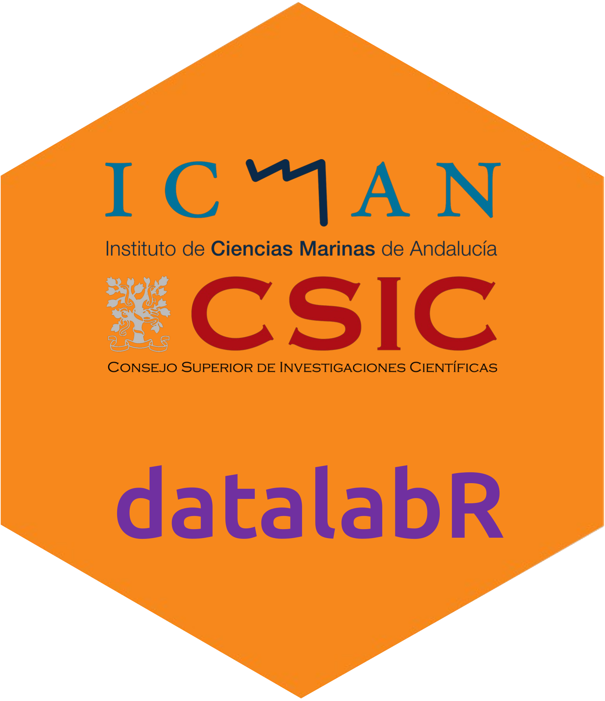

<!-- README.md is generated from README.Rmd. Please edit that file -->

```{r, include = FALSE}
knitr::opts_chunk$set(
  collapse = TRUE,
  comment = "#>",
  fig.path = "man/figures/README-",
  out.width = "100%"
)
```

<!-- <br> -->

<!-- <div style="display: flex; align-items: center; gap: 40px;"> -->
<!--   <a href="https://datalab-icman.github.io/datalab-icman"> -->
<!--      -->
<!--   </a> -->
<!--   <h1 style="margin: 0; border: none; text-decoration: none; box-shadow: none;">**datalabr**</h1> -->
<!-- </div> -->
<!-- <br> -->

# datalabR  <a href="https://datalab-icman.github.io/datalabR">  </a>

<!-- badges: start -->
<!-- badges: end -->

<br>

Provides a suite of useful tools from the Data Lab ICMAN.

## Installation

You can install the development version:

``` r
if (!require("pak")) install.packages("pak")
pak::pak("datalab-icman/datalabR")
```

## Example


```{r example}
library(datalabR)
```

Show some Unicode symbols:

```{r}
show_symbol_legend()
```

